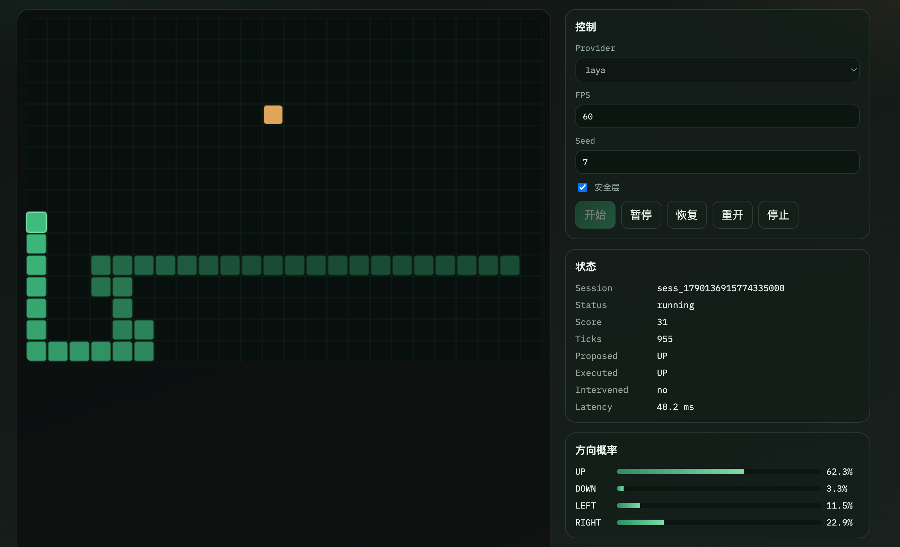

# Laya Decision Web

本机浏览器演示：通过统一决策接口切换 **laya / mock / Bocha Jev**，用 **Snake** 与 **横卷游戏判定** 展示候选动作概率与延迟。



横卷游戏判定演示（agent 模式）：

https://github.com/user-attachments/assets/6ed4108b-add3-47a7-8853-e632ac6aac1d

设计文档见 [`docs/`](docs/)。

## 快速开始

需要：

- Go **1.24**（`toolchain go1.24.13`）
- macOS + Xcode Command Line Tools（本地 Laya / Core ML）
- `third_party/tokenizers/libtokenizers.a`（缺省时执行 `make deps`；如需代理可设置 `HTTPS_PROXY`）

```bash
# 配置（首次）
cp .env.example .env

# 终端 1：后端（Air 热重载，读 .env，默认 http://127.0.0.1:18080）
./scripts/start_dev.sh
# 或：make dev

# 终端 2：前端（Vite，默认 http://127.0.0.1:5173）
make frontend
# 或：cd frontend && npm install && npm run dev
```

打开 http://127.0.0.1:5173 。Vite 会把 `/api` 代理到后端 18080。默认优先选择可用的 **laya**；也可切到 mock / bocha-jev。

无热重载的一次性启动：`make run` 或 `./scripts/run-server.sh`。
本地模型目录为 `models/snake`。若目录不完整，启动时会按 `LAYA_MODEL_ID` **阻塞下载** Hugging Face 快照到 `LAYA_MODEL_DIR`（默认 `models/snake`），完成后再监听端口。可选 `HF_TOKEN`（私有仓库）、`LAYA_MODEL_REVISION`、`HTTPS_PROXY`。

首次 Core ML 编译会生成 `models/snake/model.mlmodelc` 缓存。

生产式单入口（API + 静态前端）：

```bash
make frontend-build
STATIC_DIR=frontend/dist make run
```

## 测试

```bash
export CGO_ENABLED=1
export CGO_LDFLAGS="-L$(pwd)/third_party/tokenizers"
make test          # 全量（Laya 集成默认走 CPU）
make test-short    # 跳过 Core ML 加载
# LAYA_TEST_ANE=1 make test-laya-ane   # 可选：ANE 路径
```

## 能力概览

- Go HTTP API、SSE 会话、Snake 与横卷游戏判定引擎
- Provider：本地 Laya（Core ML ANE）、mock、Bocha Jev
- Vite + Canvas 控制台；模型缺失时自动从 Hugging Face 拉取
- 决策原样执行（无安全层改写）

Apache-2.0，见 `LICENSE` / `NOTICE`。
